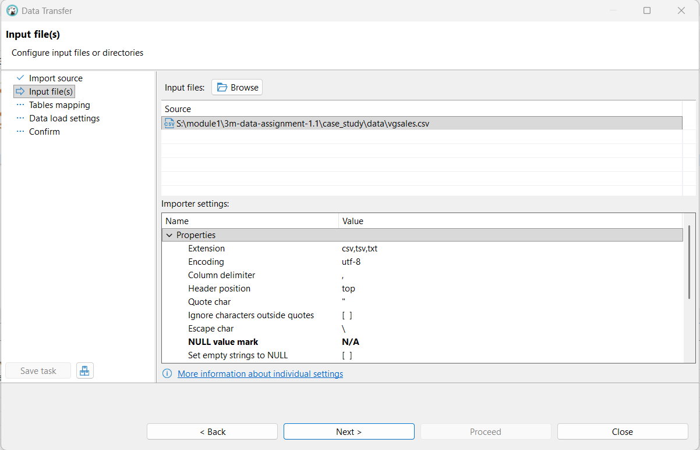

# Video Game Sales Analysis

## Dataset

You will be working with the following dataset: [Video Game Sales](https://www.kaggle.com/datasets/gregorut/videogamesales?resource=download)

📦 **Dataset Download Instructions**
1. Download the dataset ZIP file from the above link.
2. After downloading: Unzip the file to access vgsales.csv. Note the full file path to vgsales.csv — you'll need it in the next step.

🔍 **Challenge: Load the Data into DuckDB**
Using DBeaver and your DuckDB connection, how would you load the vgsales.csv file into a table so you can begin querying it?

- database - New database Connection - Create
- go to schema, right click & select Import Data
- check Table mapping to ensure correct type mapping
- in Import Setting, set NULL value Mark with 'N/A' (if not 'N/A' caused error in numeric fields)


## Business Question
How can game developers and publishers optimize their strategy to maximize global sales by understanding the performance of different game genres, platforms, and publishers?

*To answer the above question, use the following SQL queries to explore the dataset and address the following questions:*

Which genres contribute the most to global sales?

SQL:
```sql
SELECT Genre, SUM(Global_Sales) AS Total_Global_Sales FROM bysql.vgsales GROUP BY Genre ORDER BY Total_Global_Sales DESC;
```
Findings:
```findings
Action
```
Which platforms generate the highest global sales?

SQL:
```sql
SELECT Platform, SUM(Global_Sales) AS Total_Global_Sales FROM bysql.vgsales GROUP BY Platform ORDER BY Total_Global_Sales DESC;
```
Findings:
```findings
PS2
```
Which publishers are the most successful in terms of global sales?

SQL:
```sql
SELECT Publisher, SUM(Global_Sales) AS Total_Global_Sales 
FROM bysql.vgsales 
GROUP BY Publisher HAVING Total_Global_Sales > 10 
ORDER BY Total_Global_Sales DESC;
```
Findings:
```findings
Nintendo
```
How does success vary across regions (North America, Europe, Japan, Others)?

SQL:
```sql
WITH 
	sales AS (
	  SELECT
	    ROUND(SUM(NA_Sales),2) AS na,
	    ROUND(SUM(EU_Sales),2) AS eu,
	    ROUND(SUM(JP_Sales),2) AS jp,
	    ROUND(SUM(Other_Sales),2) AS oth,
	    ROUND(SUM(Global_Sales),2) AS global
	  FROM bysql.vgsales
	),
	pct_of_global AS (
	  SELECT
	    ROUND(na/global*100,1) AS na,
	    ROUND(eu/global*100,1) AS eu,
	    ROUND(jp/global*100,1) AS jp,
	    ROUND(oth/global*100,1) AS oth
	  FROM sales
	)
SELECT 'Sales' AS attributes, na AS North_America, eu AS Europe, jp AS Japan, oth as Others FROM sales UNION ALL 
SELECT '% over Global' AS attributes, na AS North_America, eu AS Europe, jp AS Japan, oth as Others FROM pct_of_global;
```
Findings:
```findings
NA contributes to 49% of global sales, followed by EU at 27% and Japan at 14%
```
What are the trends over time in game sales by genre and platform?

SQL:
```sql
SELECT Year, Genre, ROUND(SUM(Global_Sales), 2) AS total_global_sales
FROM bysql.vgsales
WHERE Year IS NOT NULL
GROUP BY Year, Genre
ORDER BY Year, total_global_sales DESC;
```
Findings:
```findings
Looks like Action and Shooting is trending towards 2000 and beyond, but charting the query result will show trending better
```
Which platforms are most successful for specific genres?

SQL:
```sql
SELECT Year, Platform, ROUND(SUM(Global_Sales), 2) AS total_global_sales
FROM bysql.vgsales
WHERE Year IS NOT NULL
GROUP BY Year, Platform
ORDER BY Year, total_global_sales DESC;
```
Findings:
```findings
need to chart the result
```
## Deliverables:
- SQL Queries: Provide all the SQL queries you used to answer the business questions.
- Summary of Findings: For each question, summarise your key findings and recommendations based on your analysis.

## Submission

- Submit the GitHub URL of your assignment to NTU black board.
- Should you reference the work of your classmate(s) or online resources, give them credit by adding either the name of your classmate or URL.
